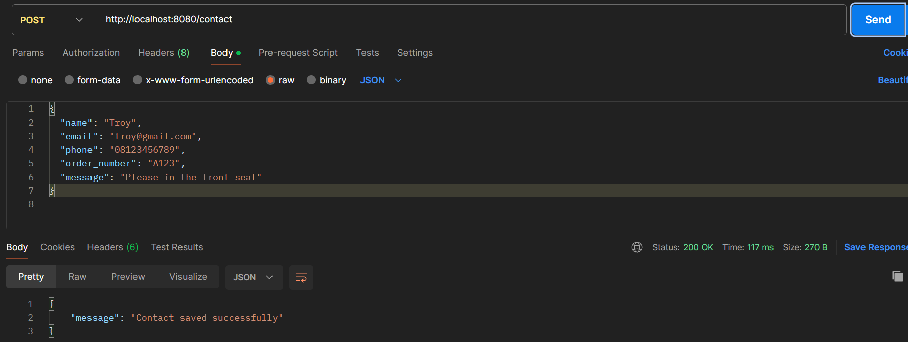
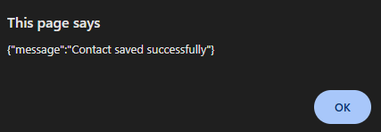

# Contact Form API

## Overview

This project is a simple REST API built using **Go (Golang)** and **MySQL** to handle submissions from a contact form.
The API receives user input from the frontend, performs **server-side validation**, and stores valid data in the database.

---

# API Endpoint

## Submit Contact Form

**Endpoint**

```
POST /contact
```


**Full URL**

```
http://localhost:8080/contact
```

**Description**

This endpoint receives contact form data from the client, validates the input, and stores the data in the MySQL database.

---

# HTTP Method

```
POST
```

This endpoint only accepts **POST requests**.
If another HTTP method is used, the server will return:

```
405 Method Not Allowed
```

---

# Sample Request Body

Content-Type:

```
application/json
```

Example request body:

```json
{
  "name": "Troy",
  "email": "troy@gmail.com",
  "phone": "08123456789",
  "order_number": "A123",
  "message": "Please in the front seat"
}
```


---

# Sample JSON Response

## Success Response

Status Code:

```
201 Created
```

Response body:

```json
{
  "message": "Contact saved successfully"
}
```

---

## Validation Error

Status Code:

```
400 Bad Request
```

Example response:

```json
Name is required
```

or

```json
Invalid email format
```

---

## Invalid HTTP Method

Status Code:

```
405 Method Not Allowed
```

Example response:

```
Invalid Method!
```

---

## Server Error

Status Code:

```
500 Internal Server Error
```

Example response:

```
Failed to save contact
```

---

# How to Run the Project Locally

### 1. Install Go

Download and install Go:

https://golang.org/dl/

Check installation:

```
go version
```

---

### 2. Install MySQL (XAMPP)

Install **XAMPP** and start the following services:

* Apache
* MySQL

Open phpMyAdmin:

```
http://localhost/phpmyadmin
```

---

### 3. Clone the Repository

```
git clone <your-git-repository-url>
cd project-folder
```

---

### 4. Install Dependencies

```
go get github.com/go-sql-driver/mysql
```

---

### 5. Run the Server

```
go run main.go
```

If successful, the terminal should display:

```
Database connection successful
```

The API will run at:

```
http://localhost:8080
```

---

# Database Setup Instructions

Open **phpMyAdmin** and run the following SQL query.

### Create Database

```sql
CREATE DATABASE midterm;
```

---

### Use Database

```sql
USE midterm;
```

---

### Create Table

```sql
CREATE TABLE contacts (
    id INT AUTO_INCREMENT PRIMARY KEY,
    name VARCHAR(100) NOT NULL,
    email VARCHAR(100) NOT NULL,
    phone VARCHAR(20),
    order_number VARCHAR(50),
    message TEXT NOT NULL,
    created_at TIMESTAMP DEFAULT CURRENT_TIMESTAMP
);
```

---

# Project Structure

```
project-folder
│
├── main.go
├── index.html
└── README.md
```

---

# Technologies Used

* Go (Golang)
* MySQL
* XAMPP
* REST API
* HTML / JavaScript (Frontend)

---

# Author

Student Backend API Project

# Documentation
